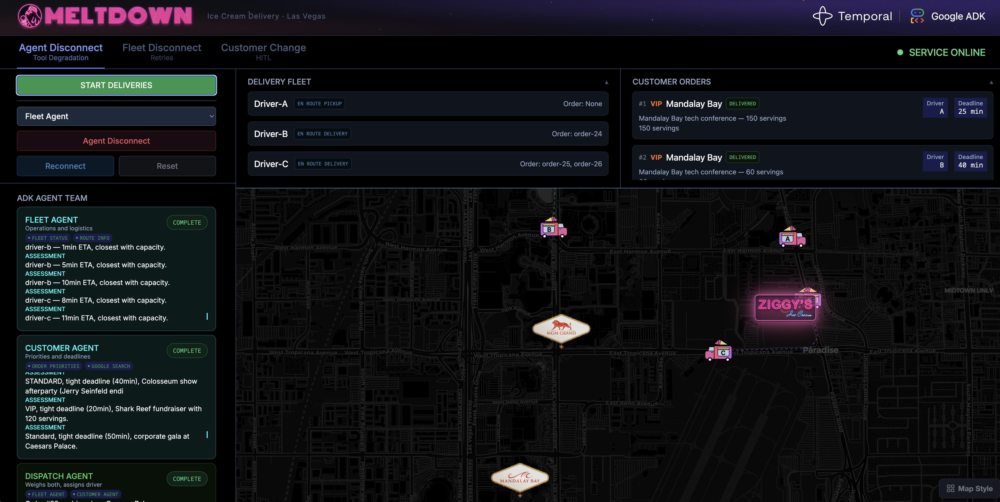
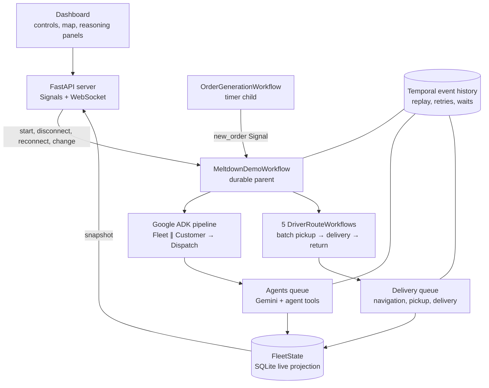

# Ziggy's Ice Cream Fleet — Google ADK + Temporal 

[](https://cloud.google.com/blog/topics/google-cloud-next/google-cloud-next-2026-wrap-up)
[](https://docs.temporal.io/develop/python/integrations/google-adk)
[](pyproject.toml)
[](LICENSE)

**Meltdown is a visual Python demo of the Google ADK integration for Temporal:
durable multi-agent reasoning, fault-tolerant delivery workflows, and
operator-in-the-loop changes on the Las Vegas Strip.**

Created for [Google Cloud Next '26](https://cloud.google.com/blog/topics/google-cloud-next/google-cloud-next-2026-wrap-up)
in Las Vegas. Google ADK composes the Fleet, Customer, and Dispatch agents;
Temporal preserves every model call, tool call, delivery step, retry, signal,
and human wait when services disappear.

> **This is the Google ADK-specific Ziggy's demo.** The
> [cross-framework Ziggy's demo](https://github.com/temporal-community/durable-hitl-agents)
> combines Google ADK and LangGraph and explores human-in-the-loop patterns for
> autonomous systems.

<p align="center">
  <a href=".github/assets/meltdown-screenshot-3.png">
    
  </a>
  <br>
  <em>The live ADK reasoning panel, five-driver fleet, and customer orders in one view. Select the image for the full-resolution capture.</em>
</p>

## See the idea in 30 seconds

| Demo | Break it | Durable behavior |
| --- | --- | --- |
| **Tool degradation** | Disconnect the Fleet Agent | Its tools fail twice, the error returns to the LLM, and Dispatch assigns with the remaining Customer Agent context. Reconnect restores full fleet-aware decisions. |
| **Service disruption** | Disconnect a driver mid-route | The driver reaches the hotel but cannot report back. Temporal retries with backoff; reconnect resumes the batch without repeating a completed delivery or teleporting the truck. |
| **Operator-in-the-loop** | Submit a cancellation or address change | The parent Workflow waits for approval while the driver Workflow holds before delivery. Approval cancels or reroutes; rejection releases the original delivery. |

> **Terminology:** AI agents **reason** through Google ADK. Delivery actors
> **execute** routes as Temporal child Workflows. They are not Temporal Workers.
> The HITL scenario is operator-initiated—the LLM does not ask for human input.

### Watch the recorded demo

<p align="center">
  <a href="https://youtube.com/shorts/Wq7hiN2KYnk">
    
  </a>
  <br>
  <em>▶ <a href="https://youtube.com/shorts/Wq7hiN2KYnk">Watch the demo on YouTube</a></em>
</p>

## The boundary that matters

> **Google ADK owns the agent loop. Temporal owns durable execution.**

| Layer | Owns |
| --- | --- |
| **Google ADK** | Agent definitions, tools, Fleet + Customer parallel assessment, Dispatch synthesis, and the multi-turn reasoning loop |
| **Temporal** | Workflow state, per-call Activities, retries, replay, timers, Signals, durable waits, and child-Workflow coordination |
| **FleetState (SQLite)** | A disposable cross-process projection for map positions, health flags, order cards, and agent events—not orchestration state |
| **FastAPI + SPA** | Demo controls, WebSocket snapshots, the Leaflet map, and reasoning panels |

`TemporalModel` routes every Gemini turn through an `invoke_model` Activity.
`activity_tool` turns every agent tool invocation into its own Activity.
`GoogleAdkPlugin` provides the deterministic runtime and Worker integration that
lets the ordinary ADK pipeline execute inside a replayable Workflow.

This gives the demo **per-call durability**: if a Worker disappears after Fleet
Agent finishes but before Dispatch Agent completes, Temporal replays the
completed results and resumes at the interrupted step instead of calling every
model and tool again.

## Architecture



The Worker process polls three task queues:

| Queue | Work |
| --- | --- |
| `meltdown-workflows` | Parent and child Workflows plus small local UI-projection Activities |
| `meltdown-delivery` | Order generation, route lookup, navigation, pickup, delivery, customer changes, and position sync |
| `meltdown-agents` | Gemini model calls and ADK tools, capped at five concurrent Activities |

Separating slow model calls from delivery Activities prevents a burst of agent
reasoning from starving navigation heartbeats. For the full execution path,
event-history tradeoffs, Signals, and replay behavior, read
[How it works](HOW_IT_WORKS.md).

## Agent team

| Agent | Decides | Tools |
| --- | --- | --- |
| **Fleet Agent** | Which available drivers are closest and have capacity | `tool_get_fleet_status`, `tool_get_route_info` |
| **Customer Agent** | Priority, urgency, deadline pressure, servings, and hotel context | `tool_get_order_priorities`, `google_search` |
| **Dispatch Agent** | The final driver assignment, including degraded decisions when an upstream tool is unavailable | `tool_submit_assignment` |

Fleet and Customer run in parallel through ADK's `ParallelAgent`; Dispatch runs
after both through `SequentialAgent`. A Workflow-side capacity guardrail rejects
assignments to full or disconnected drivers.

## Run it

### Prerequisites

- Python 3.11+
- [uv](https://docs.astral.sh/uv/) (`brew install uv`)
- [Temporal CLI](https://docs.temporal.io/cli) (`brew install temporal`)

### 1. Install

```bash
git clone https://github.com/temporal-community/ice-cream-fleet-demo
cd ice-cream-fleet-demo
cp .env.example .env
```

### 2. Choose a mode

| Mode | Configuration | Behavior |
| --- | --- | --- |
| **Mock** | Leave both values in `.env` blank | Runs the complete visual demo with deterministic agent decisions and no Google API calls |
| **Live** | Set both keys below | Runs Google ADK with Gemini, Google Search grounding, and Google Maps routes |

```dotenv
GOOGLE_API_KEY="your-gemini-key"
GOOGLE_MAPS_API_KEY="your-maps-key"
```

The keys must be separate: restrict `GOOGLE_API_KEY` to the **Generative
Language API** and `GOOGLE_MAPS_API_KEY` to the **Directions API**.

### 3. Launch

```bash
./run.sh
```

`run.sh` syncs the uv environment, starts or reuses a healthy local Temporal
development server, starts the Worker process, and serves the dashboard.

| Interface | URL |
| --- | --- |
| **Meltdown dashboard** | http://localhost:8080 |
| **Temporal UI** | http://localhost:8233 |

### 4. Run the story

1. Select **Start Deliveries** and watch orders trigger ADK reasoning.
2. Disconnect Fleet or Customer Agent to show tool-level retries and degraded decisions.
3. Disconnect a driver carrying multiple orders, then reconnect to show durable recovery.
4. Submit a customer change and approve or reject the held delivery.

The presenter-ready timing, click path, and talking points live in the
[Demo guide](DEMO_GUIDE.md).

## Code tour

| Path | Responsibility |
| --- | --- |
| `agent_fleet/workflows.py` | Parent orchestration, order generator, driver child Workflows, Signals, waits, capacity guardrail |
| `agent_fleet/agents.py` | Google ADK Fleet, Customer, and Dispatch agents |
| `agent_fleet/_activity_tool.py` | Activity-backed ADK tools with retry exhaustion returned to the LLM as context |
| `agent_fleet/activities.py` | Navigation, delivery, Google Maps, projection, and agent-tool Activities |
| `agent_fleet/worker.py` | Live/mock selection and the three Temporal Workers |
| `agent_fleet/mock/` | Deterministic Activities and Workers for the no-key demo |
| `agent_fleet/simulation.py` | SQLite WAL-backed live projection |
| `agent_fleet/server.py` | FastAPI controls, Temporal Signals, WebSocket snapshots, and static frontend |
| `frontend/index.html` | Single-file Leaflet dashboard |
| `tests/` | Activity, projection, API validation, and Workflow integration tests |

## Configuration

| Variable | Default | Purpose |
| --- | --- | --- |
| `GOOGLE_API_KEY` | empty | Enables live ADK/Gemini mode |
| `GOOGLE_MAPS_API_KEY` | empty | Enables live routes and driving ETAs |
| `DEFAULT_MODEL` | `gemini-2.5-flash` | ADK model name |
| `TEMPORAL_ADDRESS` | `localhost:7233` | Temporal Service endpoint |
| `FLEET_DB_PATH` | `./fleet_state.db` | SQLite projection path |

Configuration is loaded from the environment and `.env`.

## Developer commands

```bash
make install  # uv sync --all-extras
make lint     # Ruff lint + formatting check
make fmt      # Ruff fix + format
make test     # Pytest, including Temporal's time-skipping test server
make run      # Start the complete demo
```

## API keys

For live mode:

1. Create the Gemini key in [Google AI Studio](https://aistudio.google.com/api-keys).
2. Enable the Directions API in the
   [Google Cloud API Library](https://console.cloud.google.com/apis/library/directions-backend.googleapis.com).
3. Create and restrict a separate Maps key in
   [Google Cloud Credentials](https://console.cloud.google.com/apis/credentials).
4. Put both values in `.env` and restart `./run.sh`.

If the model key is invalid, the Generative Language API returns
`API_KEY_INVALID`. Check the copied value and confirm the key's API restriction.
Maps quota or transient route failures are returned to the Fleet Agent as tool
context so the pipeline can demonstrate graceful degradation.

## Troubleshooting

- **A port is already occupied:** `run.sh` reuses a healthy Temporal service on
  `7233`; it reports unrelated conflicts on `7233`, `8080`, or `8233` and
  never kills other processes.
- **The demo starts in mock mode:** `GOOGLE_API_KEY` is blank. Add both live-mode
  keys and restart.
- **Routes or ETAs fail in live mode:** confirm the Directions API is enabled,
  the Maps key is separate from the Gemini key, and quota is available.
- **The dashboard shows an old run:** select **Reset** before starting again.
- **Need the full failure script:** see [DEMO_GUIDE.md](DEMO_GUIDE.md).

## Learn more

- [Temporal's Google ADK integration guide](https://docs.temporal.io/develop/python/integrations/google-adk)
- [Google ADK documentation](https://google.github.io/adk-docs/)
- [Google Cloud Next '26 recap](https://cloud.google.com/blog/topics/google-cloud-next/google-cloud-next-2026-wrap-up)
- [How this demo works](HOW_IT_WORKS.md)
- [Presenter demo guide](DEMO_GUIDE.md)
- [Recorded demo](https://youtube.com/shorts/Wq7hiN2KYnk)

## License

[MIT](LICENSE)
